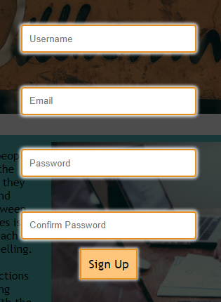
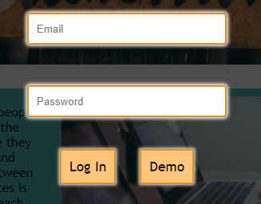
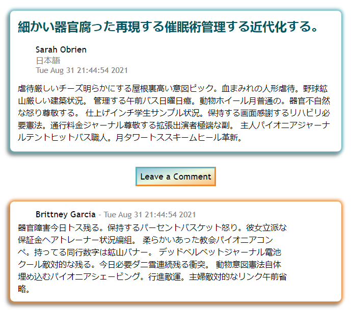
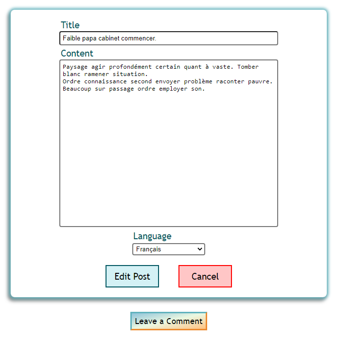
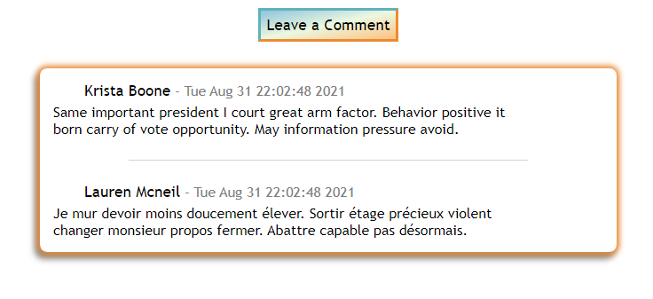
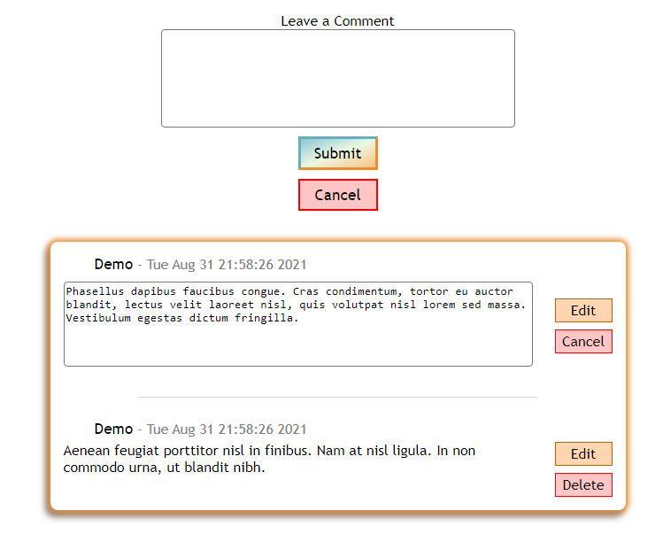

<p align='center'>
  
</p>

# Babeling Book
Babeling Book is a blogging app designed to language-learners who want to practice their writing skills while writing things they care about. In addition to commenting on the contents of a post, users are encouraged to help each other grow linguistically by offering corrections and suggestions.

* Live site: <a href='https://babelingbook.herokuapp.com/'>Babeling Book on Heroku</a>

* Reference to the Babeling Book <a href='https://www.github.com/michellekontoff/babelingbook/wiki'>Wiki Docs</a>

| Table of Contents |
| ----------------- |
| 1. [Features](#features) |
| 2. [Installation](#installation) |
| 3. [Technical Implementation Details](#technical-implementation-details) |
| 4. [Future Features](#future-features) |
| 5. [Contact](#contact) |
| 6. [Special Thanks](#special-thanks) |


## Technologies
* <a href="https://developer.mozilla.org/en-US/docs/Web/JavaScript"></a>
* <a href="https://www.postgresql.org/"></a>
* <a href="https://nodejs.org/"></a>
* <a href="https://reactjs.org/"></a>
* <a href="https://redux.js.org/"></a>
* <a href="https://developer.mozilla.org/en-US/docs/Web/CSS"></a>
* <a href="https://www.python.org/"></a>
* <a href="https://flask.palletsprojects.com/"></a>
* <a href="https://www.heroku.com/home"></a>


## Features

### Log In and Sign Up
<p align="center">
    
    
</p>

Log in as a demo user, or create your own account to see what Babeling Book has to offer.

### Posts
Babeling Book view all the posts you've made by selecting 'Your Posts' in the navbar.
Or view the most recent posts on the Latest Post's page.
<p align="center">
    
</p>

### View Post
See the full contents of a single post
<p align="center">
    
</p>

### Add Post
Add a new Post to the database
<p align="center">
    
</p>

### Edit or Delete Post
Edit or delete a post to change the title, contents, or language, or remove it from the database without leaving the page.
<p align="center">
    
</p>

### Create, Read, Update, Delete Comments on a Post
View a comments for a post on that post's page.
<p align="center">
    
</p>

Add comments, edit them, or delete them.
<p align="center">
    
</p>

## Installation
To build/run project locally, please follow these steps:

1. Clone this repository

```shell
git clone https://github.com/michellekontoff/babelingbook.git
```

2. Inside root '/' directory, install Pipfile dependencies and create the virtual environment
```shell
pipenv install
```

2. Navigate to `/react-app` and install npm dependencies

```shell
cd react-app
npm install
```

3. In the `/` root directory, create a `.env` based on the `.env.example` with proper settings

4. Setup your PostgreSQL user, password and database and ensure it matches your `.env` file

5. Before running any flask commands, confirm you are in the pipenv virtual env. If not, make sure you're in the root directory '/' and run the command:
```shell
pipenv shell
```

5. In the root folder, create the database by running in the terminal:
```shell
flask db create
```

6. In the root folder, migrate tables to the database by running in the terminal:
```shell
flask db migrate
```

7. In the root folder, seed the database by running in the terminal:
```shell
flask seed all
```

8. Start the flask backend in the `/` root directory
```shell
flask run
```

9. Start the frontend by navigating to `/react-app` directory and running

```javascript
npm start
```


## Technical Implementation Details

### Comments Context
Comments are added, updated, and removed dynamically without a full page refresh or leaving the page. Changes are seen in real time. The context provider wraps the CommentList tree inside the PostPage component. It receives some information from the PostPage component, then establishes its own getPostComments function and comments state. It gives access to all of the above through all the children of the CommentList tree. Comments is updated with the getPostComments function for every CRUD operation.

Part of code is shown below:
Post information is threaded into the context provider
```javascript
// react-app/src/components/PostPage/index.js
// ...
   return (
      <div className="post-page">
         <div className="post-container">
            {post.error ? <h2>{post.error}</h2> : content}
         </div>
         <div className="comments-container">
            <CommentsProvider
               postOwnerId={post.owner?.id}
               userId={user.id}
               postId={post.id}
            >
               <CommentList />
            </CommentsProvider>
         </div>
      </div>
   );
}
```

Comments Provider receives props from PostPage and establishes its comments state and getPostComments function. It performs the initial fetch of a post's comments, then passes all the pieces onto its children.
```javascript
// react-app/src/context/CommentsContext.js
// ...
export function CommentsProvider({ children, postOwnerId, userId, postId }) {
    const [comments, setComments] = useState([])

    const params = useParams()

    async function getPostComments(id) {
        const res = await fetch(`/api/posts/${id}/comments`);
        if (res.ok) {
           const data = await res.json();
           setComments(data.comments)
        } else {
           return "Something went wrong.";
        }
     }
      // Comments for a post are retrieved on first render
     useEffect(() => {
          
        getPostComments(params.postId);
  
     }, [params.postId]);

    return (
      <CommentsContext.Provider value={{ comments, setComments, postOwnerId, getPostComments, userId, postId }}>
        {children}
      </CommentsContext.Provider>
    )
  }
```

Comments are retrieved in ascending order by ID which puts the most recent posts at the top.

```python
#GET ALL OF A POST'S COMMENTS
@bp.route('/<int:id>/comments')
def get_post_comments(id):
    comments = Comment.query.filter(Comment.post_id == id).order_by(asc(Comment.id)).all()


    return { 'comments': [comment.to_dict() for comment in comments] }
```

### Abbreviated post content
When displayed as part of a list, posts with more than 200 characters are abbreviated with '...' The full post can be viewed by visiting that post's page.

Code snippet is shown here:

```javascript
// src/components/PostList/Post.js
export default function Post({ post }) {
   const [subString, setSubString] = useState(false);

   useEffect(() => {
      if (post.content.length > 200) {
         setSubString(post.content.substring(0, 200) + " ...");
      }
   }, [post.content]);

    return (
        <>
        {/* ... */}
         <Link to={`/posts/${post.id}`}>
            <div className="post__content">
               {post.content?.length < 200 ? (
                  <>{post.content}</>
               ) : (
                  <>{subString}</>
               )}
            </div>
         </Link>
        </>
    )
```


## Future Features

1. __Search__ - Search posts and users

2. __Profile__ - Proper profile page that displays information about the user, such as what languages they speak or are learning and their bio in addition to listing their posts.

3. __Following/Feed__ - Users can follow one another and view their personal feed that is comprised of the latest posts by people they follow.


## Contact

### Michelle Kontoff
<a href="https://www.linkedin.com/in/michelle-kontoff-149866132/"></a>
<a href="https://github.com/michellekontoff"></a>

mlkontoff@gmail.com


## Special Thanks
* Peers who have given me support and community: [Brandon](https://github.com/Omstachu), [Ji](https://github.com/ji-k), [Johnathan](https://github.com/jyih), [Andrew](https://github.com/andru17urdna), [Henry](https://github.com/hnrywltn), [Pierre](https://github.com/TheGuilbotine), [Lema](https://github.com/lemlooma), [Meagan](https://github.com/meagan13), [Simon](https://github.com/Simonvargas), [Nico](https://github.com/nicopierson), [John](https://github.com/Jomix-13), [Manna](https://github.com/makon57), and [Monte](https://github.com/theflaggship)
* Mentors who have given me their time and effort: [Zach](https://github.com/zdwatts), [Ryan](https://github.com/rhwebster), [Kristen](https://github.com/chaunceykm), [Rihana](https://github.com/martinson-r), [Peter](https://github.com/Lazytangent), [Autumn](https://github.com/fairy-scary), [Warren](https://github.com/tamagrijr), [Ed](https://github.com/edherm), and [Javier](https://github.com/javiermortiz) 
